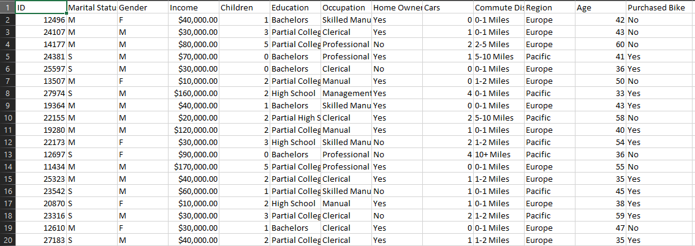
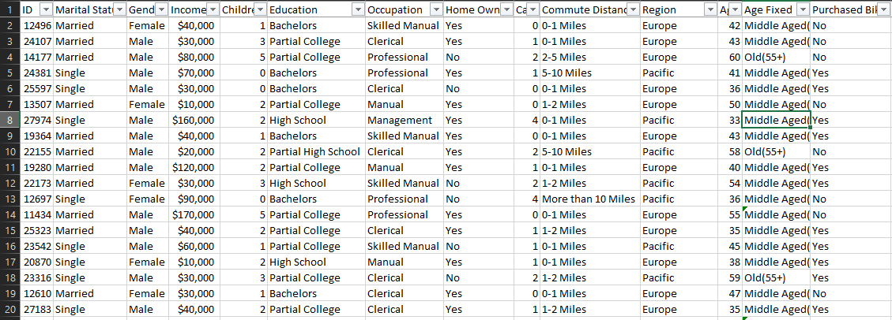

# 📊 Customer-Insights-and-Purchase-Analysis-EXCEL

This project demonstrates data cleaning and dashboarding using Microsoft Excel.

## 📊 Dataset

- **Source**: [BikesPurchased.csv](https://github.com/AlexTheAnalyst/Excel-Tutorial/blob/main/Excel%20Project%20Dataset.xlsx)

## 🧹 Data Cleaning Tasks
- Removed duplicates and null values
- Standardized categorical data (e.g., gender, age)
- Handled outliers

## 📈 Dashboard Insights
- Created interactive Pivot Charts and Slicers
- Analyzed demographic trends and bike purchasing behavior

## 🔧 Tools Used
- Microsoft Excel
- Excel Pivot Tables
- Data Validation & Conditional Formatting

## 📷 Screenshots
| Before Cleaning | After Cleaning |
|----------------|----------------|
|  |  |

## 📁 Files
- `raw_and_cleaned_dataset.xlsx` - Original & Cleaned data
- `dashboard_screenshot.png` - Final Excel dashboard
- `before_and_after_cleaning_screenshots.png` - Before & After DataSet Cleaning Image

## 📜 License
This project is licensed under the MIT License.
